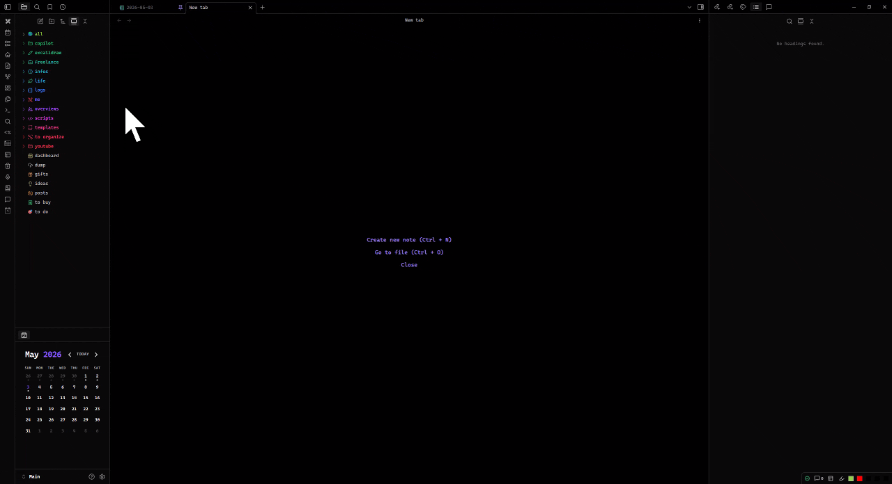

# Better Explorer

Better Explorer adds VS Code-style sticky folder headers to Obsidian's built-in file explorer.

When you scroll through a large vault, expanded parent folders stay pinned at the top of the file explorer and nested folders stack underneath them. The result is a small quality-of-life improvement: you can always see where you are without replacing Obsidian's native file explorer.

## Demo



## Features

- Sticky headers for expanded folders in Obsidian's core file explorer.
- Nested stacking for parent, child, and deeper open folders.
- Works with the existing file explorer instead of adding a separate view.
- Lightweight DOM enhancement; no vault scans on startup.
- No settings required.
- No network requests, telemetry, or data collection.
- Mobile-compatible in principle; the plugin does not use desktop-only APIs.

## Installation

### Community plugins

This plugin is not yet listed in Obsidian's community plugin directory.

Once it is available there:

1. Open **Settings → Community plugins** in Obsidian.
2. Disable **Restricted mode** if needed.
3. Select **Browse** and search for **Better Explorer**.
4. Select **Install**, then **Enable**.

### Manual install

1. Download the latest release files:
   - `manifest.json`
   - `main.js`
   - `styles.css`
2. Create this folder in your vault:

   ```text
   <Your vault>/.obsidian/plugins/obsidian-better-explorer/
   ```

3. Copy the three files into that folder.
4. Reload Obsidian.
5. Enable **Better Explorer** in **Settings → Community plugins**.

### Install from source

```bash
git clone https://github.com/iscii/obsidian-better-explorer.git
cd obsidian-better-explorer
npm install
npm run build
```

Then copy `main.js`, `manifest.json`, and `styles.css` into:

```text
<Your vault>/.obsidian/plugins/obsidian-better-explorer/
```

Reload Obsidian and enable the plugin.

## Usage

There are no commands or settings. Enable the plugin and open Obsidian's file explorer.

Expanded folders become sticky as you scroll. Collapse a folder to remove its sticky header from the stack.

## Privacy and security

Better Explorer runs locally inside Obsidian.

- It does not send network requests.
- It does not collect analytics or telemetry.
- It does not read note contents.
- It only enhances the file explorer DOM that Obsidian already renders.

## Development

```bash
npm install
npm test
npm run build
npm run dev
```

- `npm test` runs the core behavior tests.
- `npm run build` type-checks and bundles the plugin.
- `npm run dev` watches and rebuilds during development.

Release artifacts are `main.js`, `manifest.json`, and `styles.css`.

## Adding README media

Put README images in:

```text
docs/assets/
```

Suggested filenames:

```text
docs/assets/demo.gif
docs/assets/screenshot.png
```

For your 4 MB demo GIF, this is the recommended path:

```text
docs/assets/demo.gif
```

Then reference it from the README like this:

```md

```

Tips for the demo:

- Keep it under about 5 MB if possible.
- Crop tightly to the file explorer pane.
- Show one clear scroll where parent folders stick and nested headers stack.
- Avoid showing private vault names or note titles.
- Prefer a screenshot if the GIF is noisy, hard to follow, or much larger than 5 MB.

## License

0BSD
